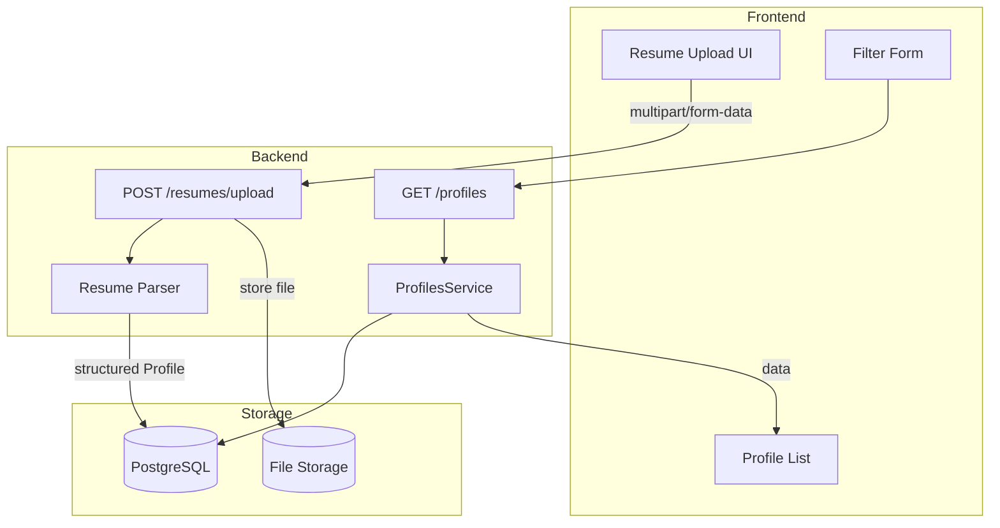

# Resume Upload and Structured Recommendation System

## Current State

- **Backend**: NestJS with in-memory profiles (100 hardcoded records)
- **Frontend**: React with filter form (skills, experience, location, gender) and profile list
- **Profile schema**: `id`, `name`, `skills[]`, `experience`, `location`, `gender`, `linkedinUrl`
- **Data flow**: `GET /profiles` with query params → filter in-memory → return paginated results

---

## Architecture Overview



---

## Phase 1: Database and File Storage Setup

### 1.1 PostgreSQL + TypeORM

- Add `@nestjs/typeorm`, `typeorm`, `pg` to backend
- Create `Profile` entity mapping to existing [profile.interface.ts](backend/src/profiles/profile.interface.ts) fields, plus:
  - `resumeUrl` (string, nullable) – path/URL to stored resume file
  - `email` (string, nullable) – extracted from resume
  - `rawText` (text, nullable) – optional for future improvements
- Add `Resume` entity for audit: `id`, `originalFilename`, `storedPath`, `profileId`, `uploadedAt`
- Configure TypeORM in [app.module.ts](backend/src/app.module.ts)

### 1.2 File Storage

- Store uploaded files under `backend/uploads/resumes/` (or `storage/` directory)
- Use `multer` (already available via NestJS) for multipart upload
- Save with unique filename: `{uuid}-{originalName}` to avoid collisions
- Add `.gitignore` entry for uploads folder

---

## Phase 2: Resume Parsing via LLM (Unstructured → Structured)

### LLM-Based Parsing Approach

Use an LLM to extract structured candidate data from resume text. The flow:

1. **Extract text** from PDF (pdf-parse) or DOCX (mammoth) – LLMs need plain text input
2. **Send text to LLM** with a structured prompt and response format
3. **Parse LLM response** as JSON matching the `Profile` schema

### 2.1 LLM: OpenAI (chosen)

- **SDK**: `openai` (official Node.js package)
- **Model**: `gpt-4o-mini` (cost-effective) or `gpt-4o` (higher accuracy)
- **Structured output**: Use `response_format: { type: "json_schema" }` with a JSON schema, or `response_format: { type: "json_object" }` for simpler JSON mode
- **Env**: `OPENAI_API_KEY` in `.env`

### 2.2 Prompt Design

- **System prompt**: Instruct the model to extract candidate info from resume text and return JSON only, no extra text
- **User prompt**: The raw resume text
- **Output schema** (align with `Profile`):
  ```json
  {
    "name": "string",
    "skills": ["string"],
    "experience": number,
    "location": "string",
    "gender": "string",
    "linkedinUrl": "string",
    "email": "string"
  }
  ```
- Instruct the model to use `""` or `"N/A"` for missing fields, `0` for unknown experience, and infer gender only if clearly stated (otherwise `"Unknown"`)

### 2.3 Parser Module

- New module: `backend/src/resume-parser/`
- `ResumeParserService`:
  - `parsePdf(buffer: Buffer): Promise<Profile>` – extract text, call LLM, return structured profile
  - `parseDocx(buffer: Buffer): Promise<Profile>` – same for DOCX
  - `extractWithLLM(text: string): Promise<Profile>` – core: send text to OpenAI, parse JSON response, validate against schema
- Inject OpenAI client; use `OPENAI_API_KEY` from `.env`

---

## Phase 3: Upload API and Integration

### 3.1 Upload Endpoint

- `POST /resumes/upload` – multipart, accepts PDF and DOCX
- Validate file type (`.pdf`, `.docx`) and size (e.g. max 5MB)
- Flow:
  1. Save file to disk
  2. Parse file → structured `Profile`
  3. Insert `Profile` into DB
  4. Link `Resume` record to `Profile`
  5. Return created profile (or redirect to profile list)

### 3.2 Migrate ProfilesService to DB

- Replace in-memory array with TypeORM repository
- Keep existing `getProfiles(filter)` logic; query DB instead of filtering array
- **Bug fix**: [App.tsx](frontend/src/App.tsx) `handlePageChange` does not pass filters – fix by storing last filters in state and passing them on page change

---

## Phase 4: Frontend Resume Upload UI

### 4.1 Upload Component

- New `ResumeUpload.tsx`:
  - Drag-and-drop or file picker
  - Accept PDF, DOCX
  - Show upload progress and success/error
  - Display extracted profile preview (editable before save, optional)
- Add to [App.tsx](frontend/src/App.tsx) – e.g. tab or section above filters

### 4.2 Optional: Profile Edit Before Save

- After parsing, show form with pre-filled fields so user can correct extraction errors
- Submit to `POST /resumes/upload` with confirmed data, or new `POST /profiles` for manual create

---

## Phase 5: Recommendation System Integration

- Existing skill-based filtering already works as a recommendation engine
- After migration to DB, `GET /profiles?skills=React,Node&experience=3` returns matching candidates from both:
  - Migrated hardcoded profiles (seed data)
  - Uploaded resumes (parsed profiles)
- **Enhancement** (optional): Add scoring/ranking – e.g. count of matching skills, recency of experience
- **Enhancement** (optional): Job description matching – parse job posting, extract required skills, rank candidates by match score

---

## Key Files to Create/Modify

| File                                                 | Action                                      |
| ---------------------------------------------------- | ------------------------------------------- |
| `backend/src/profiles/profile.entity.ts`             | Create – TypeORM entity                     |
| `backend/src/resume/resume.entity.ts`                | Create – audit entity                       |
| `backend/src/resume-parser/resume-parser.service.ts` | Create – parsing logic                      |
| `backend/src/resume/resume.controller.ts`            | Create – upload endpoint                    |
| `backend/src/profiles/profiles.service.ts`           | Modify – use TypeORM, remove hardcoded data |
| `backend/src/app.module.ts`                          | Modify – TypeORM, new modules               |
| `frontend/src/components/ResumeUpload.tsx`          | Create – upload UI                          |
| `frontend/src/App.tsx`                               | Modify – add upload, fix pagination         |

---

## Dependencies to Add

**Backend:**

- `@nestjs/typeorm`, `typeorm`, `pg`
- `@nestjs/platform-express` (multer)
- `pdf-parse` (PDF text extraction)
- `mammoth` (DOCX to text)
- `openai` (OpenAI SDK)

**Environment**: Add `OPENAI_API_KEY` to `.env` – never commit keys.

---

## Data Migration

- Seed script: Insert existing 100 hardcoded profiles into PostgreSQL on first run
- Keep `linkedinUrl` as placeholder for uploaded profiles (empty or "N/A" if not found)

---

## Open Decisions

1. **Profile edit**: Allow user to edit parsed data before saving, or save directly?
2. **Recommendation enhancement**: Keep current filter-only behavior, or add scoring/ranking?
